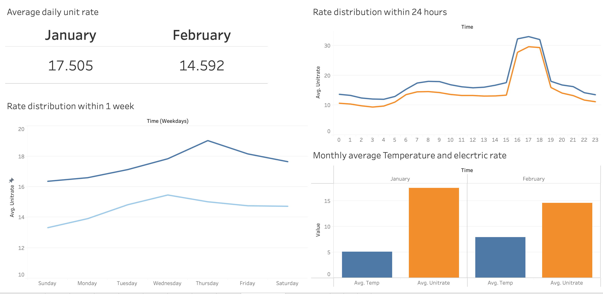
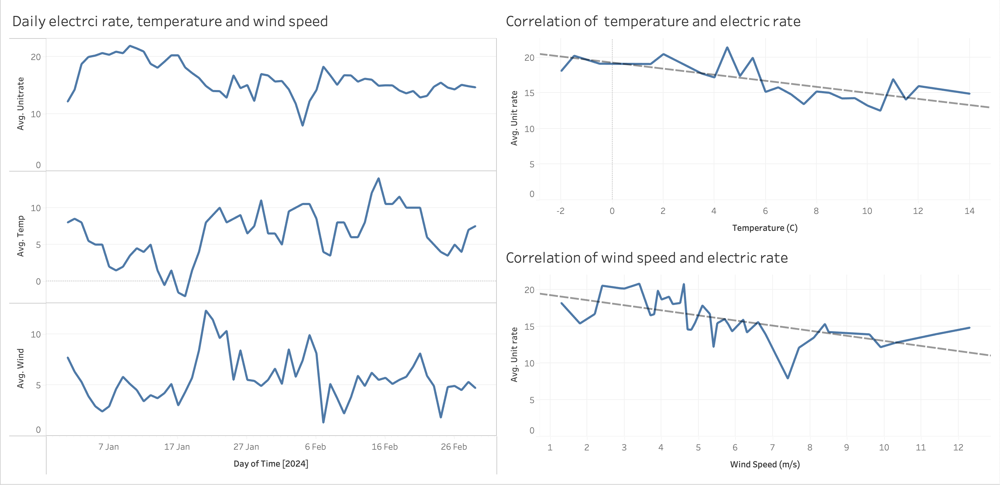

# Analysing Octopus Energy data

This is a simple data analysis project that collect data from Octopus Energy API to analysis the electricity unit rate over 2 months (Jan 2024 to Feb 2024).\
The weather in thesse 2 months are also collected in terms of temperature and the average wind speed.\

## Getting Octopus Data
Octopus has a official API documentation which allow general public access.\
Access can be found [here](https://developer.octopus.energy/docs/api/).\
Because my current tariff is **"Aglie"**, so I will use Aglie Tariff data for this project.

Octopus Energy describes it as:
> With Agile Octopus, you get access to half-hourly energy prices, tied to wholesale prices and updated daily. So when wholesale electricity prices drop, so do your bills – and if you can shift your daily electricity use outside of peak times, you can save even more.

The `python` code that used to collect the data is uploaded as `Octopus Data.py`.\
`JSON` format data is sent from API then it will be parsed and saved as `CSV` format for analysis and visualisatoin.

## Getting weather data
Daily maxium and minimum temperature and daily everage wind speed data is downloaded directly online in a `CSV` format.

Simple data cleaning need to done before anaylsing and visualisation.\
Average daily tempertaure is cauculated by taking the mean of daily max and min temperautre despite it is not 100% accurate.\
As the time interval for the electric rate is every 30min (48 data points/day) but weather data is recored as daily (1 data point/day).\
So need to transform the weather data to using 48 data that show the same value within a day.

The `python` code that used to collect the data is uploaded as `Convert_Weather_Date.py` and `Convert_Wind_Date.py`.

## Data analysis and visualisation
`Tableau` is used for the this part.
The actual files are also uploaded in the repository. 

### Unit rate trend/ insight 
- Overall Feb rate is lower than Jan
- Daily, weekly pattern of unit rate are highly simlar in Jan and Feb
- Within a day, lowest rate (cheapest to use electruic) will be midnight around 1a.m. to 5a.m.
- Within a week, lowest rate will be Sunday, Monday and Tuesday

### Unit rate and weather
Weather data is also collected for this project is due to the fact that Agile Tariff is based on wholesale price. 
As the energy supploied is 100% renewable and wind power account more than 25% of annual electric supply \
My hypothesises are:
- In a warmer month/day, people will use less enery for heating and therefore, lower unit rate.
- If there is stronger wind, there will be more wind power and hence the unit rate may be lower.
- Unfortunately the correlation on wind (0.40) vs unit rate or temperature (0.53) vs unit rate is not very low (as it should be negative correlation, so the closer to 0 the better), so the correlation is not very promising.

## Conclusion
- Best time to use electric is Sunday to Tue from 1a.m. to 5a.m.
- Based on limted data and simple analysis, there is not strong correlation between wind speed or temperature to unit rate.

